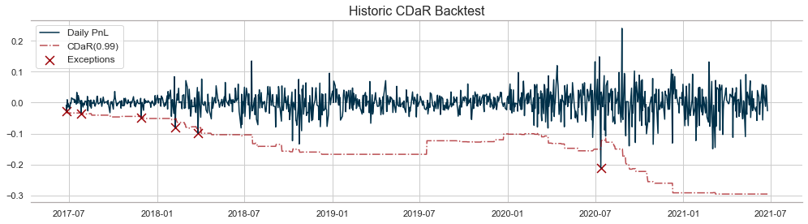

<div align="center">
  <p>
    <a href='https://www.freepik.com/vectors/business'>
      
    </a>
  </p>

<h4 align="center">Value-at-Risk</h4>

<p align="center">
  <a href="https://media0.giphy.com/media/VbnUQpnihPSIgIXuZv/giphy.gif">
    
  </a>
  <a href="https://i.makeagif.com/media/10-25-2015/oWi1M-.gif">
    
  </a>
</p>

<p align="center">
  <a href="#introduction">Introduction</a> •
  <a href="#key-features">Key Features</a> •
  <a href="#examples">Examples</a> •
  <a href="#installation">Installation</a> •
  <a href="#dependencies">Dependencies</a> •
</p>
</div>

# Introduction

"The search for appropriate risk measuring methodologies has been followed by increased financial uncertainty worldwide. Financial
turmoil and the increased volatility of financial markets have induced the design and development of more sophisticated tools for
measuring and forecasting risk. The most well known risk measure is value at risk (VaR), which is defined as the maximum loss over
a targeted horizon for a given level of confidence. In other words, it is an estimation of the tails of the empirical distribution
of financial losses. It can be used in all types of financial risk
measurement" ([Julija Cerović Smolović, 2017](https://doi.org/10.1080/1331677X.2017.1305773)).

In addition to Value at Risk, the package includes Conditional Value at Risk (Expected Shortfall or CVaR) and Conditional Drawdown
at Risk (CDaR).

# Key Features

Calculate, Backtest and Plot the

- Value at Risk,
- Conditional Value at Risk,
- Conditional Drawdown at Risk, 
  
with different methods, such that:
- Historical
- Parametric
- Monte Carlo
- Stressed Monte Carlo
- Parametric GARCH 
  
methods.

# Examples
In this example we will show all the key features of the `var` package. At first we will import all 
necessary packages. 
```python
from var import VaR, load_data
import numpy as np
```

To quickly test and demonstrate the functions, the package includes a function named `load_data`, which by default 
includes the daily returns of stocks `TSLA`, `AAPL` and `NFLX`.
```python
data = load_data()
print(data)
```
```console
              NFLX      AAPL     TSLA
Date                                 
2016-06-28  0.0056  0.001725 -0.00020
2016-06-29  0.0139  0.001075  0.01012
2016-06-30  0.0057  0.002900 -0.00138
2016-07-01  0.0167  0.001000  0.02072
2016-07-05  0.0271 -0.001000  0.00850
            ...       ...      ...
2021-06-21 -0.0464  0.020000 -0.03650
2021-06-22  0.1028  0.018500  0.05460
2021-06-23  0.0426 -0.000700  0.24570
2021-06-24  0.0010 -0.010400  0.04830
2021-06-25 -0.0177 -0.003500 -0.17710
[1258 rows x 3 columns]
```
The only important thing in the data preparation is that the columns contain the individual 
positions of the portfolio, and the rows the date.  Another important point is that the 
column "Date" should be defined as an index, and it must also be formatted as a date.

Now we can define some weights for the individual positions and initialize the `VaR` class:
```python
weights = np.array([0.40, 0.50, 0.10])

var = VaR(data, weights)
```
The standard confidence is at `0.01`. Individual confidences can be defined with the parameter
`alpha`:
```python
var = VaR(data, weights, alpha=0.05)
var
```
```console
<VaR - μ: 0.05%, σ: 3.5096%, Portfolio σ: 3.511%>
```
The `repr` of the class provides the following information:
* μ : The mean return of the portfolio.
* σ : The unweighted volatility of the portfolio.
* Portfolio σ : The weighted volatility of the portfolio.

You can summarize the results of the different methods with the method:
```python
var.summary().round(2)  # or use print(var)
```
```console
                      VaR(0.99)  CVaR(0.99)  CDaR(0.99)
2022-04-27                                             
Parametric                -0.13       -0.15       -0.64
Historical                -0.20       -0.21       -0.64
Monte Carlo               -0.13       -0.14       -0.64
Stressed Monte Carlo      -0.16       -0.17       -0.64
```

You can access the different VaR methods by using the methods:
```python
var.historic()
```
```console
            VaR(0.99)  CVaR(0.99)
2021-06-25  -0.203479   -0.211246
```
```python
var.parametric()
```
```console
            VaR(0.99)  CVaR(0.99)
2021-06-25  -0.130036   -0.149269 
```
```python
var.monte_carlo()
```
```console
            VaR(0.99)  CVaR(0.99)
2021-06-25  -0.132929    -0.13989 
```
```python
var.monte_carlo(stressed=True)
```
```console
            VaR(0.99)  CVaR(0.99)
2021-06-25  -0.159149   -0.162875 
```

Or access to the Conditional Drawdown at Risk with:
```python
var.cdar()
```
```console
           CDaR(0.99)
2021-06-25  -0.636892
```
### Backtest
You can backtest the accuracy of each method with the method `backtest` and the method keys:
* 'h': VaR calculated with the historical method,
* 'p': VaR calculated with the parametric method,
* 'mc': VaR calculated with the monte carlo method,
* 'smv': VaR calculated with the stressed monte carlo method,

```python
bth = var.backtest(method='h')
```
```console
Backtest: Historic Method: 100%|██████████| 1008/1008 [00:03<00:00, 332.53it/s]  
```

Evaluate the backtest results with the method `evalutate`
```python
var.evaluate(bth)
```
```console
           Amount   Percent Mean Deviation STD Deviation Min Deviation  \
VaR(0.99)      10  0.009921      -0.023765      0.028671     -0.003515   
CVaR(0.99)     10  0.009921      -0.023407      0.028545     -0.003382   
CDaR(0.99)      6  0.005952      -0.017702       0.02285     -0.001713   

           Max Deviation  
VaR(0.99)      -0.099554  
CVaR(0.99)     -0.098803  
CDaR(0.99)     -0.060682  
```

The table contains the following information:
* Amount : Total amount of exceptions.
* Percent : Total amount of exceptions in relative to all observations (multiply this by 100 to obtain
  the total amount of exceptions in percent).
* Mean Deviation : The mean value of the exceptions.
* STD Deviation : The standard deviation of the exceptions.
* Min Deviation : The wort overestimation of the value.
* Max Deviation : The worst underestimation of the value.


### Plot Backtest
Plot the backtest results via:
```python
var.plot(bth, "var")
```


```python
var.plot(bth, "cvar")
```


```python
var.cdar_plot(bth)
```


# Installation

There are currently different methods to install `var`.

### Using pip

The ` var ` package is provided on pip. You can install it with::

    pip install var

### Standard Python

You can also download the source code package from this repository or from pip. Unpack the file you obtained into some directory (
it can be a temporary directory) and then run::

    python setup.py install

# Dependencies

* Python: Python 3.7
* Packages: numpy, pandas, scipy, matplotlib, tqdm, seaborn, numba
