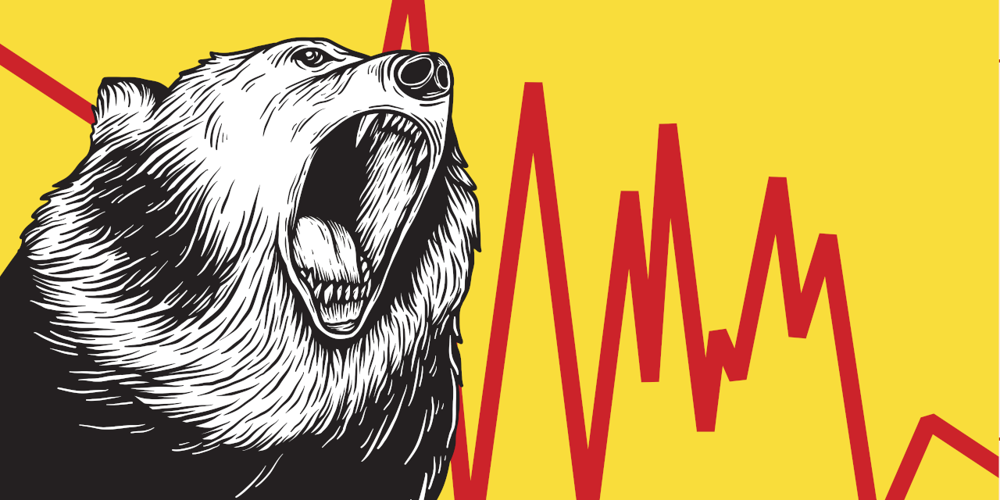

  

    
  

<h4 align="center">Value-at-Risk</h4>

  
  

  <a href="#introduction">Introduction</a> •
  <a href="#key-features">Key Features</a> •
  <a href="#installation">Installation</a> •
  <a href="#dependencies">Dependencies</a> •
  <a href="#example">Example</a> •
  <a href="#documentation">Documentation</a>

# Introduction
The search for appropriate risk measuring methodologies has been followed by increased financial uncertainty
worldwide. Financial turmoil and the increased volatility of financial markets have induced the design and
development of more sophisticated tools for measuring and forecasting risk. The most well known risk measure is
value at risk (VaR), which is defined as the maximum loss over a targeted horizon for a given level of confidence.
In other words, it is an estimation of the tails of the empirical distribution of financial losses. It can be used
in all types of financial risk measurement.

This introruction is from ([Julija Cerović Smolović, 2017](https://doi.org/10.1080/1331677X.2017.1305773)).

# Key Features
Calculate, Backtest and Plot the Value-at-Risk or the Conditional-Value-at-Risk with different methods:
   - Historical
   - Parametric
   - Monte Carlo
   - Stressed Monte Carlo
   - Parametric GARCH
